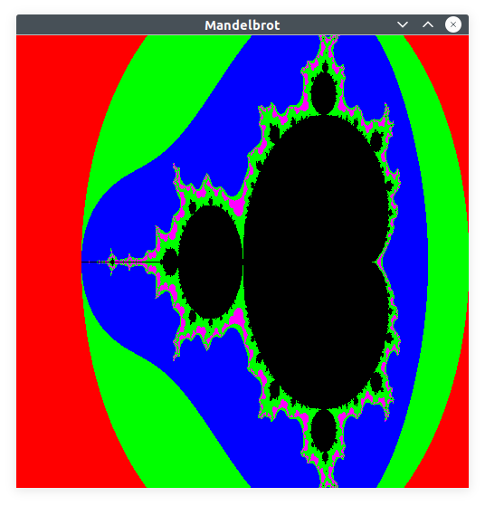

# BuhLog
 
BuhLog is a class for logging messages using the Qt logging mechanisms (QLoggingCategory).

BuhLog features:
 - Use of the Qt logging mechanisms
 - Multithreaded
 - Different log levels (Info, Warning, Error, ...)
 - Output depending on configuration in a common file or in a file per thread as well as additional output on the console
 - Log rotation for the created log files. Rotation after a certain time (e.g. every 5 minutes) or a certain size of the log files (configurable).

BuhlLog is demonstrated with the calculation of Mandelbrot fractals.  
Mandelbrot fractals are calculated on a 500x500 pixel matrix.  

## Requirements(BuhLog): 
- Qt5/Qt6::Core

## Requirements(Mandelbrot):
- Qt5/Qt6::Core
- Qt5/Qt6::Gui
- Qt5/Qt6::Widgets

## Build instructions
In BuhLog folder
> cmake ..   
> make -j8

Build and tested on Linux Ubuntu
Ubuntu 20.04.5 LTS

